# 무신사페이먼츠 포인트 시스템

## 목차

1. [프로젝트 개요](#프로젝트-개요)
2. [기술 스택](#기술-스택)
3. [빌드 및 실행](#빌드-및-실행)
4. [API 문서](#api-문서)
5. [과제 요구사항 충족 사항](#과제-요구사항-충족-사항)
6. [ERD 및 아키텍처](#erd-및-아키텍처)
7. [프로젝트 구조](#프로젝트-구조)

---

## 프로젝트 개요

무료 포인트 적립/사용/취소 기능을 제공하는 백엔드 API 시스템입니다.

### 주요 기능

| 기능        | 설명                                  |
|-----------|-------------------------------------|
| 포인트 적립    | 1포인트 단위 사용 추적, 수기 지급 구분, 만료일 관리     |
| 포인트 적립 취소 | 미사용 적립 건 전체 취소                      |
| 포인트 사용    | 수기 지급 우선 → 만료일 짧은 순으로 사용            |
| 포인트 사용 취소 | 전체/부분 취소, 만료 포인트는 신규 적립 처리          |
| 잔액/내역 조회  | 회원별 잔액 조회, 주문별 사용 내역 조회             |

### 핵심 특징

- **1포인트 단위 추적**: 어떤 적립 건에서 얼마를 사용했는지 추적
- **동적 설정 관리**: 1회 최대 적립 금액, 개인별 최대 보유 금액 등 런타임 변경 가능
- **사용 우선순위**: 수기 지급 포인트 우선, 그 다음 만료일 짧은 순
- **만료 포인트 처리**: 사용 취소 시 만료된 포인트는 신규 적립으로 처리

---

## 기술 스택

| 구분     | 기술                                 |
|--------|------------------------------------|
| 언어     | Kotlin, Java 21                    |
| 프레임워크  | Spring Boot 3.5.7, Spring Data JPA |
| 데이터베이스 | H2 (개발), PostgreSQL (운영 권장)        |
| 빌드     | Gradle 8.14.3                      |
| 테스트    | Kotest, MockK                      |
| 문서화    | SpringDoc OpenAPI 3 (Swagger)      |
| 아키텍처   | 헥사고날 아키텍처 (Hexagonal Architecture) |

---

## 빌드 및 실행

### 사전 요구사항

- JDK 21

### 빌드 및 실행

```bash
# 빌드
./gradlew build

# 실행
./gradlew bootRun

# 또는 JAR 실행
java -jar build/libs/musinsa-payments-0.0.1-SNAPSHOT.jar
```

### 접속 정보

| 항목         | URL                                         |
|------------|---------------------------------------------|
| API 서버     | http://localhost:8080                       |
| Swagger UI | http://localhost:8080/swagger-ui/index.html |
| H2 콘솔      | http://localhost:8080/h2-console            |

> H2 접속: JDBC URL `jdbc:h2:mem:testdb`, Username `sa`, Password 없음

### 초기 설정값

| 설정 키                             | 기본값        | 설명            |
|----------------------------------|------------|---------------|
| MAX_ACCUMULATION_AMOUNT_PER_TIME | 100,000    | 1회 최대 적립 금액   |
| MAX_BALANCE_PER_MEMBER           | 10,000,000 | 개인별 최대 보유 금액  |
| DEFAULT_EXPIRATION_DAYS          | 365        | 기본 만료일        |
| MIN_EXPIRATION_DAYS              | 1          | 최소 만료일        |
| MAX_EXPIRATION_DAYS              | 1,824      | 최대 만료일 (약 5년) |

---

## API 문서

### 주요 엔드포인트

| 메서드  | 엔드포인트                                      | 설명          |
|------|--------------------------------------------|-------------|
| POST | `/api/points/accumulate`                   | 포인트 적립      |
| POST | `/api/points/accumulate/{pointKey}/cancel` | 적립 취소       |
| POST | `/api/points/use`                          | 포인트 사용      |
| POST | `/api/points/use/{pointKey}/cancel`        | 사용 취소       |
| GET  | `/api/points/balance/{memberId}`           | 잔액 조회       |
| GET  | `/api/points/history/{memberId}`           | 사용 내역 조회    |
| GET  | `/api/admin/points/config`                 | 설정 조회 (관리자) |
| PUT  | `/api/admin/points/config/{configKey}`     | 설정 변경 (관리자) |

### API 사용 예시

```bash
# 포인트 적립
curl -X POST http://localhost:8080/api/points/accumulate \
  -H "Content-Type: application/json" \
  -d '{"memberId": 1, "amount": 1000, "expirationDays": 365, "isManualGrant": false}'

# 포인트 사용
curl -X POST http://localhost:8080/api/points/use \
  -H "Content-Type: application/json" \
  -d '{"memberId": 1, "orderNumber": "A1234", "amount": 500}'

# 잔액 조회
curl http://localhost:8080/api/points/balance/1
```

> 전체 API 문서는 Swagger UI에서 확인하세요: http://localhost:8080/swagger-ui/index.html

---

## 과제 요구사항 충족 사항

### ✅ 기능 요구사항

| 요구사항                    | 구현 | 설명                                       |
|-------------------------|:--:|------------------------------------------|
| 1회 적립 가능 범위 (1~10만 포인트) | ✅  | `MAX_ACCUMULATION_AMOUNT_PER_TIME` 동적 설정 |
| 개인별 최대 보유 금액 제한         | ✅  | `MAX_BALANCE_PER_MEMBER` 동적 설정           |
| 1포인트 단위 사용 추적           | ✅  | `PointUsageDetail` 엔티티로 상세 기록            |
| 수기 지급 포인트 구분            | ✅  | `isManualGrant` 필드로 구분                   |
| 만료일 관리 (1일~5년)          | ✅  | 적립 시 만료일 검증, 기본 365일                     |
| 적립 취소 (미사용 시만 가능)       | ✅  | 사용된 금액 있으면 취소 불가                         |
| 사용 우선순위 (수기→만료일 짧은 순)   | ✅  | `PointUsagePriorityService` 구현           |
| 사용 취소 (전체/부분)           | ✅  | 부분 취소 가능, 여러 번 취소 가능                     |
| 만료 포인트 사용 취소 시 신규 적립    | ✅  | 만료된 포인트는 새 pointKey로 적립                  |

### ✅ 기술 요구사항

| 요구사항              | 구현 | 설명                              |
|-------------------|:--:|---------------------------------|
| Java 21           | ✅  | Kotlin + Java 21                |
| Spring Boot 3.x   | ✅  | Spring Boot 3.5.7               |
| H2 Database       | ✅  | 인메모리 DB 사용                      |
| ERD 다이어그램         | ✅  | `resource/erd.svg`              |
| AWS 아키텍처 다이어그램    | ✅  | `resource/aws-architecture.svg` |
| README (빌드/과제 설명) | ✅  | 현재 문서                           |

### 📝 예시 시나리오 구현

```
1. 1000원 적립 (A) → 잔액: 1000원
2. 500원 적립 (B)  → 잔액: 1500원
3. 1200원 사용 (C) → A에서 1000원 + B에서 200원 사용 → 잔액: 300원
4. A 적립 만료
5. 1100원 사용 취소 (D)
   - A(만료): 1000원 신규 적립 (E)
   - B(유효): 100원 잔액 복원
   → 잔액: 1400원
```

---

## ERD 및 아키텍처

### ERD 다이어그램


### AWS 아키텍처 다이어그램



### 설계 문서

| 문서                                                         | 설명               |
|------------------------------------------------------------|------------------|
| [01-도메인-분석.md](docs/01-도메인-분석.md)                          | 도메인 분석 및 요구사항    |
| [02-ERD-설계.md](docs/02-ERD-설계.md)                          | 데이터베이스 설계        |
| [03-도메인-모델-설계.md](docs/03-도메인-모델-설계.md)                    | 도메인 모델 설계        |
| [04-API-설계.md](docs/04-API-설계.md)                          | REST API 설계      |
| [05-비즈니스-로직-설계.md](docs/05-비즈니스-로직-설계.md)                  | 비즈니스 로직 설계       |
| [06-설정-관리-설계.md](docs/06-설정-관리-설계.md)                      | 설정 관리 설계         |
| [07-프로젝트-구조-설계.md](docs/07-프로젝트-구조-설계.md)                  | 프로젝트 구조 설계       |
| [08-AWS-아키텍처-설계.md](docs/08-AWS-아키텍처-설계.md)                | AWS 아키텍처 설계      |
| [09-테스트-전략.md](docs/09-테스트-전략.md)                          | 테스트 전략           |
| [10-문서화-계획.md](docs/10-문서화-계획.md)                          | 문서화 계획           |
| [11-향후-개선-사항.md](docs/11-향후-개선-사항.md)                      | 향후 개선 사항 (분산락 등) |

---

## 프로젝트 구조

```
com.musinsa.payments.point
├── domain                   # 도메인 레이어 (핵심 비즈니스 로직)
│   ├── entity               # 도메인 엔티티
│   ├── valueobject          # 값 객체 (Money, PointKey 등)
│   ├── service              # 도메인 서비스
│   └── exception            # 도메인 예외
├── application              # 애플리케이션 레이어 (유스케이스)
│   ├── port/input           # 인바운드 포트 (Use Case)
│   ├── port/output          # 아웃바운드 포트 (영속성, 설정)
│   ├── service              # 애플리케이션 서비스
│   └── event                # 이벤트 핸들러
├── infrastructure           # 인프라 레이어 (외부 시스템)
│   ├── persistence          # JPA 엔티티, 리포지토리, 어댑터
│   ├── config               # 설정 어댑터
│   └── event                # 이벤트 발행자
└── presentation             # 프레젠테이션 레이어
    └── web                  # REST 컨트롤러, DTO
```

### 의존성 방향

```
Presentation → Application → Domain
                    ↓          ↑
Infrastructure ────────────────┘
```

---

## 테스트

```bash
# 전체 테스트 실행
./gradlew test

# 커버리지 리포트
./gradlew test jacocoTestReport
# 리포트 위치: build/reports/jacoco/test/html/index.html
```

---

## 라이선스

무신사페이먼츠 Backend Engineer 과제 전형을 위한 프로젝트입니다.
