# 02. ERD 설계

## 1. 개요

무료 포인트 시스템의 데이터베이스 구조를 설계합니다. 1원 단위 추적, 만료일 관리, 수기 지급 구분 등의 요구사항을 반영합니다.

## 2. 엔티티 식별

### 2.1 핵심 엔티티

#### 2.1.1 Member (사용자)
- 사용자 정보를 관리하는 엔티티
- 포인트 시스템의 주체

#### 2.1.2 PointAccumulation (포인트 적립)
- 포인트 적립 정보를 관리하는 핵심 엔티티
- 각 적립 건은 고유한 pointKey를 가짐
- 수기 지급 여부, 만료일 정보 포함

#### 2.1.3 PointUsage (포인트 사용)
- 포인트 사용 정보를 관리하는 엔티티
- 주문번호와 함께 사용 내역 기록
- 사용 건별로 고유한 pointKey를 가짐

#### 2.1.4 PointUsageDetail (포인트 사용 상세)
- 포인트 사용의 상세 내역을 1원 단위로 추적
- 어떤 적립 건에서 얼마를 사용했는지 기록
- 1원 단위 추적을 위한 필수 엔티티

#### 2.1.5 PointConfig (포인트 설정)
- 동적 설정을 관리하는 엔티티
- 1회 최대 적립 금액, 개인별 최대 보유 금액, 기본 만료일 등

#### 2.1.6 PointCancellation (포인트 취소)
- 적립 취소 및 사용 취소 정보를 관리하는 엔티티
- 취소 유형(적립 취소/사용 취소) 구분

## 3. 엔티티 상세 설계

### 3.1 Member (사용자)

| 컬럼명 | 타입 | 제약조건 | 설명 |
|--------|------|----------|------|
| id | BIGINT | PK, AUTO_INCREMENT | 사용자 ID |
| member_no | VARCHAR(50) | UNIQUE, NOT NULL | 사용자 번호 |
| name | VARCHAR(100) | NOT NULL | 사용자 이름 |
| created_at | TIMESTAMP | NOT NULL | 생성일시 |
| updated_at | TIMESTAMP | NOT NULL | 수정일시 |

**비고**:
- member_no는 비즈니스 식별자로 사용
- 실제 사용자 인증/인가는 별도 시스템으로 가정

### 3.2 PointAccumulation (포인트 적립)

| 컬럼명 | 타입 | 제약조건 | 설명 |
|--------|------|----------|------|
| id | BIGINT | PK, AUTO_INCREMENT | 적립 ID |
| point_key | VARCHAR(50) | UNIQUE, NOT NULL | 포인트 키 (예: A, B) |
| member_id | BIGINT | FK, NOT NULL | 사용자 ID |
| amount | DECIMAL(10,0) | NOT NULL, CHECK(amount > 0) | 적립 금액 |
| available_amount | DECIMAL(10,0) | NOT NULL, DEFAULT 0 | 사용 가능 잔액 |
| expiration_date | DATE | NOT NULL | 만료일 |
| is_manual_grant | BOOLEAN | NOT NULL, DEFAULT FALSE | 수기 지급 여부 |
| status | VARCHAR(20) | NOT NULL | 상태 (ACCUMULATED, CANCELLED, EXPIRED) |
| created_at | TIMESTAMP | NOT NULL | 생성일시 |
| updated_at | TIMESTAMP | NOT NULL | 수정일시 |

**비고**:
- point_key는 비즈니스 식별자 (예: A, B, E)
- available_amount는 사용 가능한 잔액 (amount에서 사용된 금액을 뺀 값)
- status는 적립 상태를 나타냄
- 만료일은 적립 시점 + 설정된 만료일로 계산

**인덱스**:
- member_id, status, expiration_date (복합 인덱스) - 사용 우선순위 조회용
- is_manual_grant, expiration_date (복합 인덱스) - 수기 지급 우선 조회용

### 3.3 PointUsage (포인트 사용)

| 컬럼명 | 타입 | 제약조건 | 설명 |
|--------|------|----------|------|
| id | BIGINT | PK, AUTO_INCREMENT | 사용 ID |
| point_key | VARCHAR(50) | UNIQUE, NOT NULL | 포인트 키 (예: C, D) |
| member_id | BIGINT | FK, NOT NULL | 사용자 ID |
| order_number | VARCHAR(50) | NOT NULL | 주문번호 |
| total_amount | DECIMAL(10,0) | NOT NULL, CHECK(total_amount > 0) | 총 사용 금액 |
| cancelled_amount | DECIMAL(10,0) | NOT NULL, DEFAULT 0 | 취소된 금액 |
| status | VARCHAR(20) | NOT NULL | 상태 (USED, PARTIALLY_CANCELLED, FULLY_CANCELLED) |
| created_at | TIMESTAMP | NOT NULL | 생성일시 |
| updated_at | TIMESTAMP | NOT NULL | 수정일시 |

**비고**:
- point_key는 사용 건별 고유 식별자
- total_amount는 사용한 총 금액
- cancelled_amount는 취소된 금액 (부분 취소 지원)
- status는 사용 상태를 나타냄

**인덱스**:
- member_id, order_number (복합 인덱스) - 사용자별 주문 조회용
- order_number - 주문번호로 조회용

### 3.4 PointUsageDetail (포인트 사용 상세)

| 컬럼명 | 타입 | 제약조건 | 설명 |
|--------|------|----------|------|
| id | BIGINT | PK, AUTO_INCREMENT | 상세 ID |
| point_usage_id | BIGINT | FK, NOT NULL | 포인트 사용 ID |
| point_accumulation_id | BIGINT | FK, NOT NULL | 포인트 적립 ID |
| amount | DECIMAL(10,0) | NOT NULL, CHECK(amount > 0) | 사용 금액 (1원 단위) |
| cancelled_amount | DECIMAL(10,0) | NOT NULL, DEFAULT 0 | 취소된 금액 |
| created_at | TIMESTAMP | NOT NULL | 생성일시 |
| updated_at | TIMESTAMP | NOT NULL | 수정일시 |

**비고**:
- 1원 단위 추적을 위한 핵심 엔티티
- point_usage_id와 point_accumulation_id의 관계로 어떤 적립에서 얼마를 사용했는지 추적
- amount는 1원 단위로 기록 가능
- cancelled_amount는 사용 취소 시 기록

**인덱스**:
- point_usage_id - 사용 건별 상세 조회용
- point_accumulation_id - 적립 건별 사용 내역 조회용

### 3.5 PointConfig (포인트 설정)

| 컬럼명 | 타입 | 제약조건 | 설명 |
|--------|------|----------|------|
| id | BIGINT | PK, AUTO_INCREMENT | 설정 ID |
| config_key | VARCHAR(50) | UNIQUE, NOT NULL | 설정 키 |
| config_value | VARCHAR(255) | NOT NULL | 설정 값 |
| description | VARCHAR(500) | | 설명 |
| created_at | TIMESTAMP | NOT NULL | 생성일시 |
| updated_at | TIMESTAMP | NOT NULL | 수정일시 |

**비고**:
- 동적 설정 관리를 위한 엔티티
- config_key 예시:
  - `MAX_ACCUMULATION_AMOUNT_PER_TIME`: 1회 최대 적립 금액 (기본: 100000)
  - `MAX_BALANCE_PER_MEMBER`: 개인별 최대 보유 금액
  - `DEFAULT_EXPIRATION_DAYS`: 기본 만료일 (기본: 365)
  - `MIN_EXPIRATION_DAYS`: 최소 만료일 (기본: 1)
  - `MAX_EXPIRATION_DAYS`: 최대 만료일 (기본: 1824, 약 5년)

### 3.6 PointCancellation (포인트 취소)

| 컬럼명 | 타입 | 제약조건 | 설명 |
|--------|------|----------|------|
| id | BIGINT | PK, AUTO_INCREMENT | 취소 ID |
| point_key | VARCHAR(50) | UNIQUE, NOT NULL | 포인트 키 (취소 건 식별자) |
| cancellation_type | VARCHAR(20) | NOT NULL | 취소 유형 (ACCUMULATION_CANCELLATION, USAGE_CANCELLATION) |
| target_point_key | VARCHAR(50) | NOT NULL | 대상 포인트 키 (적립/사용 키) |
| member_id | BIGINT | FK, NOT NULL | 사용자 ID |
| amount | DECIMAL(10,0) | NOT NULL, CHECK(amount > 0) | 취소 금액 |
| reason | VARCHAR(500) | | 취소 사유 |
| created_at | TIMESTAMP | NOT NULL | 생성일시 |

**비고**:
- 적립 취소와 사용 취소를 모두 관리
- cancellation_type으로 구분
- target_point_key는 취소 대상이 되는 적립/사용 건의 point_key

**인덱스**:
- target_point_key - 대상 건별 취소 내역 조회용
- member_id, cancellation_type - 사용자별 취소 내역 조회용

## 4. 관계 정의

### 4.1 관계 다이어그램

```
Member (1) ────< (N) PointAccumulation
Member (1) ────< (N) PointUsage
PointUsage (1) ────< (N) PointUsageDetail
PointAccumulation (1) ────< (N) PointUsageDetail
Member (1) ────< (N) PointCancellation
```

### 4.2 관계 상세

#### 4.2.1 Member ↔ PointAccumulation
- **관계**: 1:N (한 사용자는 여러 적립 건을 가짐)
- **외래키**: PointAccumulation.member_id → Member.id
- **CASCADE**: Member 삭제 시 관련 적립 건 처리 정책 필요

#### 4.2.2 Member ↔ PointUsage
- **관계**: 1:N (한 사용자는 여러 사용 건을 가짐)
- **외래키**: PointUsage.member_id → Member.id
- **CASCADE**: Member 삭제 시 관련 사용 건 처리 정책 필요

#### 4.2.3 PointUsage ↔ PointUsageDetail
- **관계**: 1:N (한 사용 건은 여러 상세 내역을 가짐)
- **외래키**: PointUsageDetail.point_usage_id → PointUsage.id
- **CASCADE**: PointUsage 삭제 시 상세 내역도 삭제

#### 4.2.4 PointAccumulation ↔ PointUsageDetail
- **관계**: 1:N (한 적립 건은 여러 사용 상세 내역에 사용됨)
- **외래키**: PointUsageDetail.point_accumulation_id → PointAccumulation.id
- **CASCADE**: PointAccumulation 삭제 시 상세 내역 처리 정책 필요

#### 4.2.5 Member ↔ PointCancellation
- **관계**: 1:N (한 사용자는 여러 취소 건을 가짐)
- **외래키**: PointCancellation.member_id → Member.id

## 5. 제약조건 및 비즈니스 규칙

### 5.1 데이터 무결성 제약조건

#### 5.1.1 PointAccumulation
- `available_amount <= amount` (사용 가능 잔액은 적립 금액 이하)
- `available_amount >= 0` (사용 가능 잔액은 0 이상)
- `expiration_date > created_at` (만료일은 생성일 이후)

#### 5.1.2 PointUsage
- `cancelled_amount <= total_amount` (취소 금액은 총 사용 금액 이하)
- `cancelled_amount >= 0` (취소 금액은 0 이상)

#### 5.1.3 PointUsageDetail
- `cancelled_amount <= amount` (취소 금액은 사용 금액 이하)
- `cancelled_amount >= 0` (취소 금액은 0 이상)

### 5.2 비즈니스 규칙

#### 5.2.1 적립 취소 가능 조건
- `PointAccumulation.status = 'ACCUMULATED'`
- `PointAccumulation.available_amount = PointAccumulation.amount`
- 즉, 사용된 금액이 없어야 함

#### 5.2.2 사용 우선순위 조회
```sql
-- 수기 지급 우선, 그 다음 만료일 짧은 순
SELECT * FROM point_accumulation
WHERE member_id = ?
  AND status = 'ACCUMULATED'
  AND available_amount > 0
  AND expiration_date > CURRENT_DATE
ORDER BY is_manual_grant DESC, expiration_date ASC
```

## 6. ERD 다이어그램

### 6.1 ERD 다이어그램



> **참고**: ERD 다이어그램의 소스 파일(`resource/erd.mmd`)과 이미지 파일(PNG, SVG, PDF)은 `resource/` 디렉토리에서 확인할 수 있습니다.

### 6.2 관계 설명

- **Member ↔ PointAccumulation**: 1:N 관계 (한 사용자는 여러 적립 건을 가짐)
- **Member ↔ PointUsage**: 1:N 관계 (한 사용자는 여러 사용 건을 가짐)
- **Member ↔ PointCancellation**: 1:N 관계 (한 사용자는 여러 취소 건을 가짐)
- **PointUsage ↔ PointUsageDetail**: 1:N 관계 (한 사용 건은 여러 상세 내역을 가짐)
- **PointAccumulation ↔ PointUsageDetail**: 1:N 관계 (한 적립 건은 여러 사용 상세 내역에 사용됨)

### 6.3 주요 인덱스

- **PointAccumulation**:
  - `member_id, status, expiration_date` (복합 인덱스) - 사용 우선순위 조회용
  - `is_manual_grant, expiration_date` (복합 인덱스) - 수기 지급 우선 조회용
- **PointUsage**:
  - `member_id, order_number` (복합 인덱스) - 사용자별 주문 조회용
  - `order_number` - 주문번호로 조회용
- **PointUsageDetail**:
  - `point_usage_id` - 사용 건별 상세 조회용
  - `point_accumulation_id` - 적립 건별 사용 내역 조회용
- **PointCancellation**:
  - `target_point_key` - 대상 건별 취소 내역 조회용
  - `member_id, cancellation_type` (복합 인덱스) - 사용자별 취소 내역 조회용

### 6.4 ERD 다이어그램 파일

ERD 다이어그램 파일은 `resource/` 폴더에 저장되어 있습니다:
- **Mermaid 소스 파일**: `resource/erd.mmd`
- **PNG 이미지**: `resource/erd.png` (239KB)
- **SVG 이미지**: `resource/erd.svg` (134KB, 벡터 이미지, 권장)
- **PDF 문서**: `resource/erd.pdf` (84KB)
- **이미지 변환 가이드**: `resource/README.md`

#### Mermaid 이미지로 변환하기

Mermaid 파일을 PNG, SVG, PDF 이미지로 변환하려면 다음 방법을 사용할 수 있습니다:

##### **Mermaid CLI 사용** (권장)

```bash
npm install -g @mermaid-js/mermaid-cli
cd resource/
mmdc -i erd.mmd -o erd.png    # PNG
mmdc -i erd.mmd -o erd.svg    # SVG (벡터, 권장)
mmdc -i erd.mmd -o erd.pdf    # PDF
```

변환된 이미지 파일은 동일한 `resource/` 폴더에 저장하시면 됩니다.

## 7. 성능 고려사항

### 7.1 인덱스 전략
- **PointAccumulation**: member_id, status, expiration_date 복합 인덱스 (사용 우선순위 조회)
- **PointUsage**: member_id, order_number 복합 인덱스 (사용자별 주문 조회)
- **PointUsageDetail**: point_usage_id, point_accumulation_id 인덱스 (조인 성능)

### 7.2 파티셔닝 고려
- 대용량 데이터를 고려한 파티셔닝 전략 (옵션)
- 날짜 기준 파티셔닝 고려 (만료일, 생성일 기준)

## 8. 다음 단계

다음 단계에서는 도메인 모델 설계를 통해 엔티티를 Kotlin 클래스로 구체화할 예정입니다.

---

**다음 문서**: [03. 도메인 모델 설계](./03-도메인-모델-설계.md)

